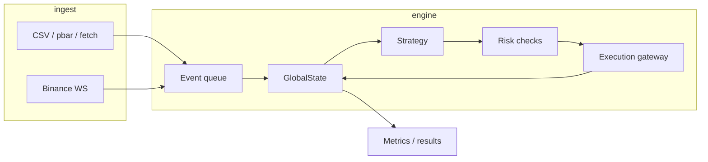

# Athena's Pallas — architecture

Event-driven trading engine with one core loop for **live**, **paper**, and **backtest** modes.

## Layers

| Layer | Crate path | Role |
|-------|------------|------|
| Data | `data/fetch`, `backtest/sources` | Download OHLCV; normalize CSV layouts |
| Replay | `backtest/runner`, `backtest/merge` | Deterministic historical event stream |
| State | `state.rs` | Balances, positions, L1/L2, fills |
| Execution | `execution/paper.rs` | Simulated fills, fees, margin-aware cash flows |
| Strategy | `strategy/` | In-process trait or external JSON-line subprocess |
| Risk | `risk.rs` | Position limits, pause, daily loss (live-oriented) |
| Results | `results/mod.rs` | JSON + JSONL persistence |

## Backtest hot path

1. Load config (`BacktestConfig`) from TOML or CLI.
2. Build `InstrumentRegistry` (primary + `[[instruments]]` extras).
3. Merge CSV sources when extras declare `data` paths.
4. For each bar: `apply_market` → strategy → risk → paper gateway → `apply_bar_lifecycle` (funding/coupons/exercise).
5. Record portfolio equity; summarize with trade ledger + optional risk-free Sharpe.

## Performance notes

See [PERFORMANCE.md](PERFORMANCE.md). Binary `.pbar` sidecars avoid CSV parse on repeat runs; criterion benches live under `athenas-pallas/benches/`.

## CLI tools

| Binary | Purpose |
|--------|---------|
| `pallas-backtest` | Run backtest from TOML/flags |
| `pallas-fetch` | Download Binance/Yahoo OHLCV |
| `pallas-resample` | Offline bar aggregation |
| `pallas-merge` | K-way merge CSV streams by timestamp |
| `pallas-sweep` | Grid search over TOML parameters |
