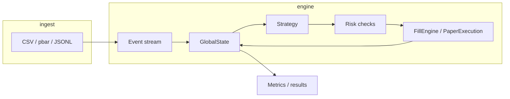

# Athena's Pallas Architecture

Event-driven **backtest** engine with a single synchronous replay loop. External C++/Python strategies attach via newline-delimited JSON.



## Layers

| Layer | Crate path | Role |
|-------|------------|------|
| Data | `bar.rs`, `backtest/sources` | Load canonical OHLCV/pbar data and normalize FX L1 quotes |
| Replay | `backtest/runner`, `backtest/merge`, `engine/replay` | Deterministic historical event stream and streaming k-way source merge |
| State | `state.rs` | Balances, positions, L1/L2, fills |
| Execution | `execution/fills.rs`, `execution/sync_paper.rs` | Simulated fills, fees, margin-aware cash flows |
| Strategy | `strategy/`, `trading/` | In-process trait or external JSON-line subprocess; strategy folders are auto-detected |
| Risk | `risk.rs` | Position limits, pause, daily loss checks |
| Results | `results/mod.rs` | JSON + JSONL persistence |

## Backtest Flow

1. Load `BacktestConfig` from TOML or CLI flags.
2. Build `InstrumentRegistry` from the primary symbol plus `[[instruments]]` extras.
3. Resolve strategy names/paths through `backtest::strategy_resolver`.
4. Load OHLCV from `.pbar` or streamed CSV.
5. For multi-instrument runs, stream-merge sources with `merge_sources_iter`.
6. For each event: update state, call strategy, run risk checks, simulate fills, apply lifecycle hooks, and record equity.
7. Summarize with trade ledger stats and optional risk-free Sharpe/Sortino.

## Strategy Layout

New strategies should live directly under `trading/<strategy_name>/`.

```text
trading/
  _sdk/
    python/
    cpp/
  simple_sma/
    strategy.py
  simple_sma_cpp/
    CMakeLists.txt
    main.cpp
```

The resolver detects CMake C++ directories, Python directories/files, and compiled binaries.

## CLI Tools

| Binary | Crate | Purpose |
|--------|-------|---------|
| `pallas-backtest` | `athenas-pallas` | Run backtest from TOML/flags |
| `pallas-resample` | `athenas-pallas-tools` | Offline bar aggregation |
| `pallas-sweep` | `athenas-pallas-tools` | Grid search over TOML parameters |

See [PERFORMANCE.md](PERFORMANCE.md) for hot-path details and benchmark commands.
